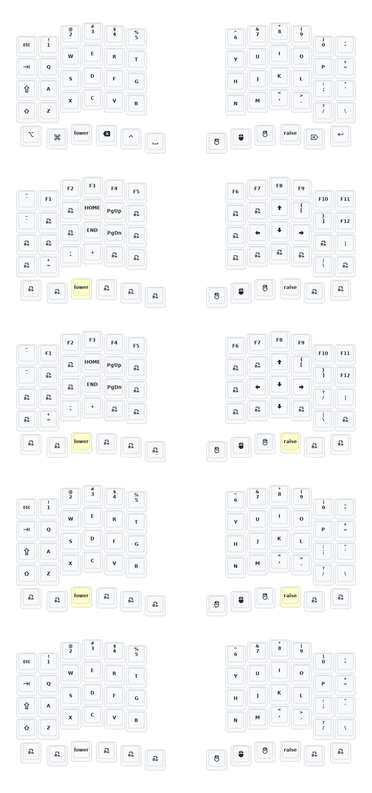

# Sofle, Soufflé and CYN Sofle(Mini Sofle) wireless split keyboard ZMK firmware for nRF52840 nice!nano and analogues. With ESB Dongle Mode and PS/2 trackpoint on right hand.

Support editing keymap via https://nickcoutsos.github.io/keymap-editor/ and via https://zmk.studio/ ZMK Studio.

Dongle mode: the nRF52840 nice!nano central microcontroller(or any direct analogue) is connected to the PC via USB. The left and right hands are wirelessly connected to the microcontroller via the nRF ESB 2.4GHz mode(not BLE).

Right hand uses PS/2 trackpoint module(SDA on P.017 pin and SCL on P0.20 pin - instead default OLED display pins on any Sofle; plus a separate reset circuit on the board itself).

## CYN Sofle Keymap layout

